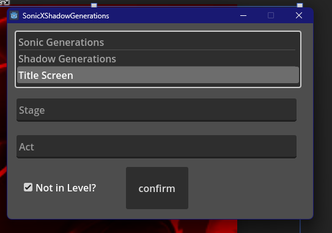

# Sonic x Shadow Generations Discord RPC

## Introduction

Enhance your Discord status with themed updates for Sonic x Shadow Generations fans using this Discord Rich Presence (RPC) integration.

## Download and Installation

1. Download the latest release from [here](https://github.com/Wunaa/SonicxShadowGenerationsRPC/releases/tag/v1.0.0).

2. Extract the downloaded ZIP file to a folder on your computer.

3. Double-click the executable (`Sonic X Shadow Generations.exe`) to run the Discord RPC.

## Usage

- Once the application is running, your Discord status will automatically update to reflect in-game activities.

- Customize your experience by modifying settings within the program.

## Contributing

Contributions are welcome! Fork the repository, make changes, and submit a pull request.

## License

This project is licensed under the [MIT License](LICENSE).
